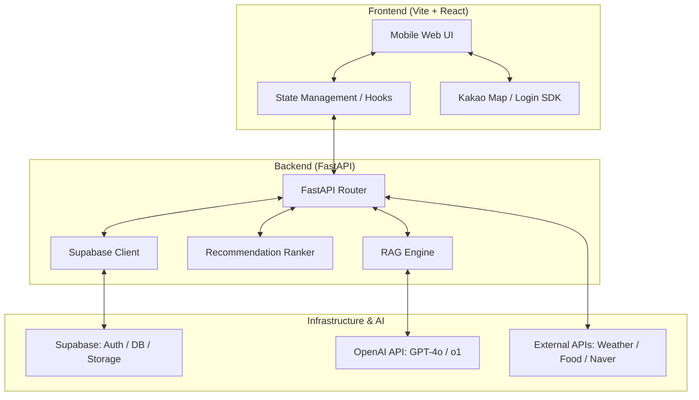

# [종합 보고서] 밥친구(Ricefreind) 서비스 분석 및 기술 전략

본 보고서는 **밥친구(식구)** 서비스의 현재 코드베이스를 바탕으로 시스템 구조, 기술 전략, 로드맵 및 향후 발전 방향을 정리한 종합 분석서입니다. 팀원들과의 공유 및 Part 3 개발의 지침서로 활용하시기 바랍니다.

---

## 🏗️ 1. 서비스 시스템 구조도 (System Architecture)

## 🛠️ 2. 핵심 기술 전략 (Technical Strategy)

### A. 하이브리드 추천 엔진 (Hybrid Recommendation)
- **RAG (Retrieval-Augmented Generation)**: 단순히 LLM의 지식에 의존하지 않고, 식품영양성분 DB 및 사용자 프로필 데이터를 실시간으로 참조하여 답변 신뢰도를 높입니다.
- **ML Ranking**: 추천된 후보군을 사용자의 선호도, 칼로리 목표 달성률, 현재 날씨 등의 특성(Feature)을 기반으로 머신러닝 모델(LGBM/XGBoost 등)이 재정렬(Re-ranking)합니다.

### B. 서버리스 지향 아키텍처
- **Supabase Edge Functions**: API 서버의 부하를 줄이고 특정 로직(예: 챗봇 통신)을 지연 없이 처리하기 위해 엣지 컴퓨팅을 활용합니다.
- **PostgreSQL 기반 벡터 DB**: 향후 메뉴 검색 고도화를 위해 Supabase의 pgvector 기능을 활용한 시맨틱 검색을 고려하고 있습니다.

## 📈 3. 프로젝트 진행 단계 (Current Progress)

- **Part 1 (완료)**: 디자인 시스템 구축, 주요 화면 UI/UX 개발 (로그인, 대시보드, 챗봇, 식사 기록 등).
- **Part 2 (완료)**: 프론트엔드-백엔드 API 규격 정의 및 기본 통신 프로토타입 구현, 외부 API 키 연동.
- **Part 2.5 (완료)**: **틴더 스타일 스와이프 UX 도입**. 추천 페이지의 시각적 강조 및 조작성 고도화.
- **Part 3 (진행 중)**: **"데이터의 실재화"**. Mock 데이터를 실제 DB로 전환하고 로직의 안정성을 확보하는 단계.

## 🚀 4. 발전 방향 및 로드맵 (Evolution & Roadmap)

### 단기 목표 (Next Steps)
1. **데이터 영속성 확보**: 모든 Mock 리스트를 Supabase PostgreSQL 테이블로 전환.
2. **소셜 로그인 완성**: 카카오 인증 토큰을 활용한 실제 사용자 식별 및 보안 강화.

### 중장기 목표 (Vision)
1. **커뮤니티 활성화**: 사용자 간 식단 공유 및 피드 기능을 통한 게이미피케이션 요소 도입.
2. **개인화 고도화**: 사용자의 식사 패턴을 딥러닝으로 분석하여 자동 식단 구성 기능 제공.
3. **오프라인 연동**: 식당 예약 및 모바일 주문 API 연동을 통한 서비스 확장.

## ⚖️ 5. 팀 협업 및 기술 가이드
- **문서 관리**: `docs/` 폴더 내의 번호 순서에 따라 설계 및 진행 상황을 관리합니다.
- **코드 품질**: 백엔드는 Pydantic 스키마를 통한 타입 검증을, 프론트엔드는 TypeScript의 인터페이스를 엄격히 준수합니다.

---

> [!TIP]
> 본 문서는 프로젝트의 나침반 역할을 합니다. 개발 과정에서 설계가 변경될 경우 반드시 이 문서를 선행 업데이트해 주세요.
